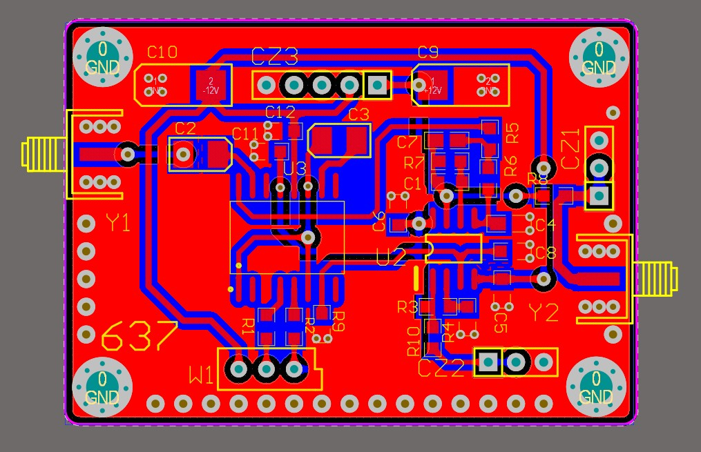
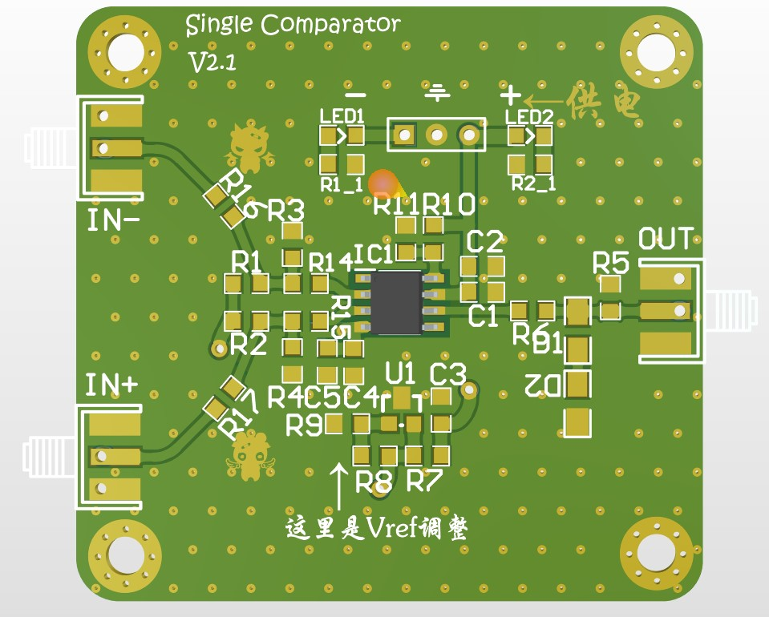
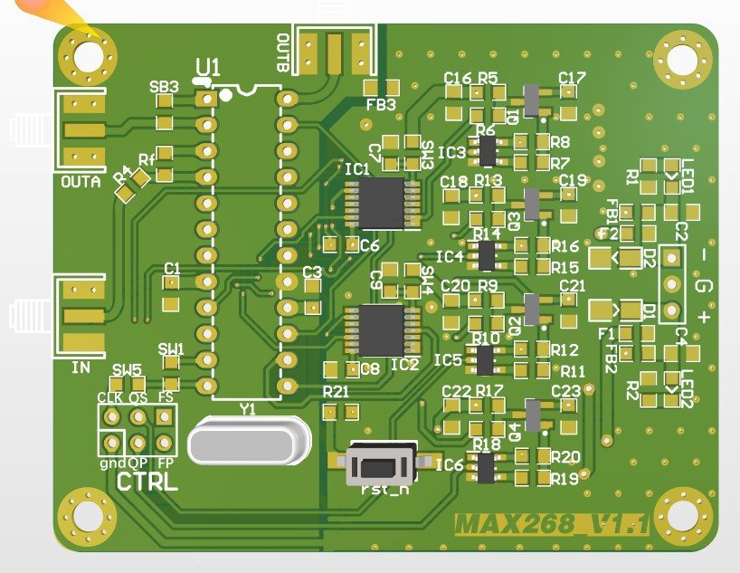
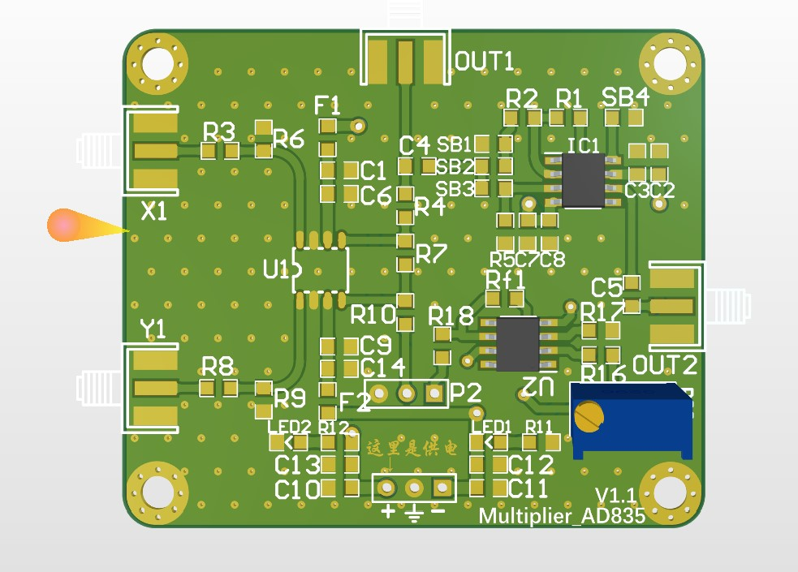
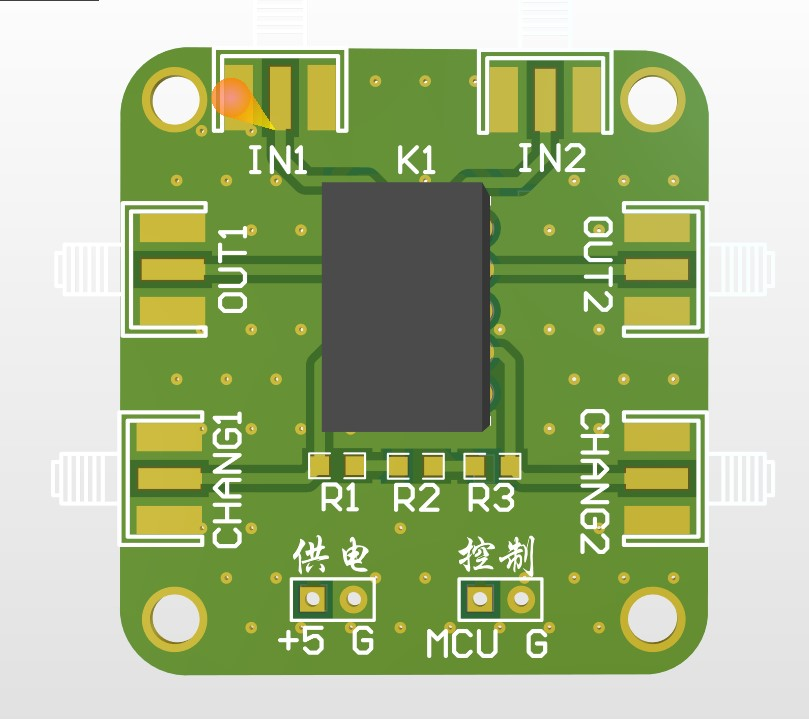
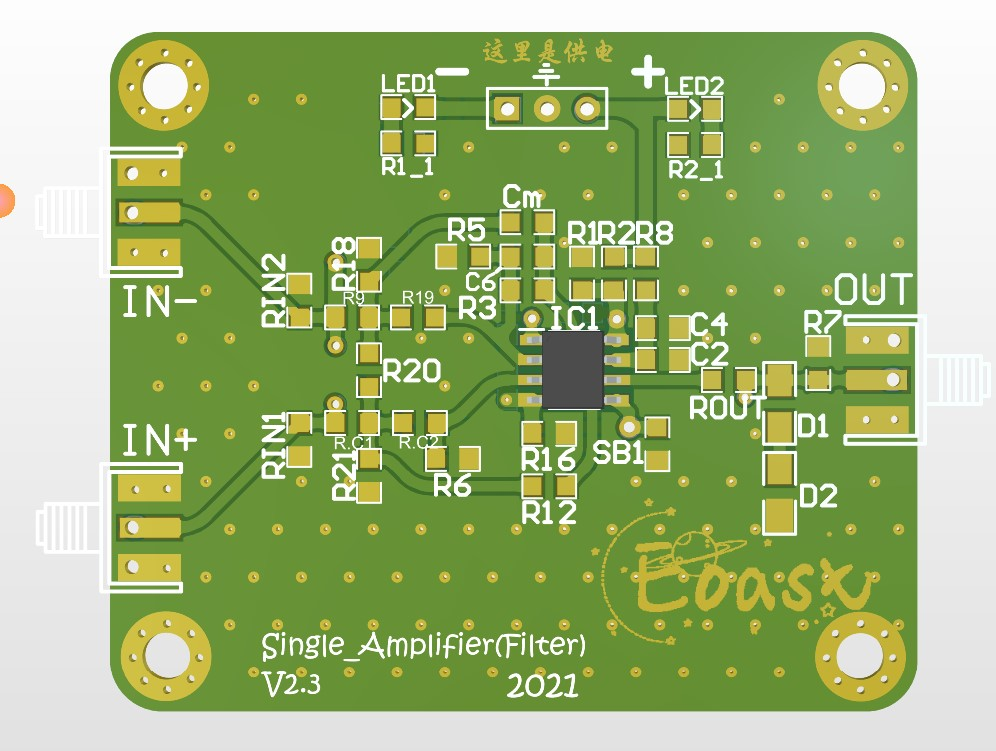

# `OpenPCB`

------

## 介绍

本工程建立于帮助EOAST的学弟学妹们学习PCB设计的初衷，开源一些我在大二大三期间设计的（除了`ＡＤ６３７`）自认为还算能用的（指其中的模拟电路模块实测30MHz之内好用，再高频未测试）PCB。多个模块为了达到通用性使用了冗余设计，使用者可以按照实际应用进行取舍。这些冗余设计大部分都在PCB工程的原理图中说明了用意。同时也因为这些冗余，在使用中可能会有很多不理解的部分，请自己思考一下，对于PCB初入门者相信会有所收获，还是想不出来的话，可以通过邮箱1317783287@qq.com联系我。若是有电子爱好者看到了这项工程中的疏忽，或者愿意帮助我修正一些不妥的设计，也欢迎交流！

## 工程目录

| 名称                        | 功能                                                         | PCB渲染图                                          |
| --------------------------- | ------------------------------------------------------------ | -------------------------------------------------- |
| AD637有效值模块             | 真有效值检测                                                 |   |
| Comparator                  | 单比较器，实测用TLV3501时50MHz以内好用                       |    |
| MAX268                      | 程控滤波器（SPI接口）                                        |     |
| Multiplier＿AD835           | 乘法器                                                       |   |
| Relay＿Ctrl                 | 继电器                                                       |  |
| Single_Amplifier(Filter)2.0 | 单运放通用板，可以实现求和放大、积分、微分、移相、滤波（`SallenKey`拓扑）等 |   |

**注：其中MAX268是古董芯片了，市场上很少，也很贵，虽然性能很好，但是常见的是MAX266，便宜很多。之所以还要分享这个工程出来，是因为这块板子用到了一个具有学习意义的电平标准转换电路。**

使用的软件为AD

## 安全性

